優先度付きキュー(PriorityQueue)をRubyで車輪の再発明してみたら大分苦戦した。

atcoderの初級者向けコンテストに参加していると、優先度付きキューが必要なシーンにしばしば遭遇する。そして解説にはこんな風に書かれている。(例: ABC234 D問題)

>しかし、大抵のプログラミング言語の標準ライブラリに備わっている「優先度付きキュー」と呼ばれるデータ構造を用いると以下の操作をそれぞれ $O(\log N)$ ($N$ は操作時点での要素数) で行うことができ、これにより時間計算量を $O(N\log K)$ まで改善することが可能です。

>大抵のプログラミング言語の標準ライブラリに備わっている

残念ながらRubyには備わってない。

ので作ることになった。

## 優先度付きキューとは
優先度付きキューとは、優先度の最も高い値を効率よく取り出せるデータ構造のこと。

優先度で一番よくあるのが『最も小さい(大きい)値』。

普通の配列で最小値(最大値)を求めようとすると、全要素を走査する必要があるので計算量は $O(N)$ 。これだと処理時間の制約に引っかかって大体TLEになる。

優先度付きキューだと $O(\log N)$ で求められるので大分速い。その代わり一般的なキューのようにFIFOで値を取り出したりはできない。

優先度付きキューの実装で最もポピュラーなのがヒープを使ったもの。Pythonの場合は`heapq`という名前で実装されてたりする。

## ヒープの実装イメージ
ヒープで優先度付きキューを実装するイメージを図にしてみる。

ちなみに、未確認飛行Cさんの説明が最高にわかりやすいので、基本的にはこちらを見に行った方が良い。

https://ufcpp.net/study/algorithm/col_heap.html

なぜ最高にわかりやすい説明があるのにわざわざ図を描くかというと、ブログで[mermaid](https://mermaid-js.github.io/mermaid/#/)の記法が使えるようになったので試したくなったから。

### 小さい順のヒープ
小さい方が優先度が高いヒープを図にするとこんな感じになる。最も小さい値`2`が根に置かれている。

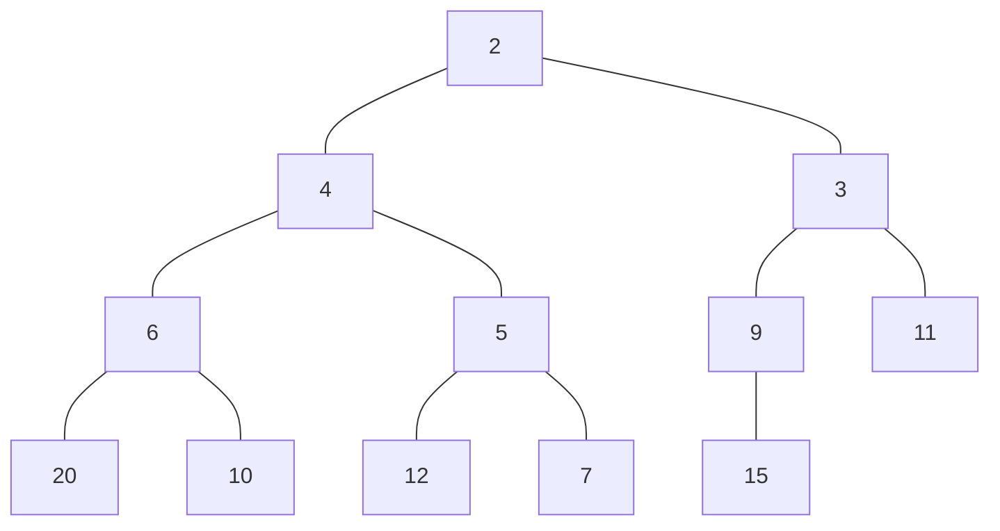

ヒープは以下のような性質を持っている。

- ヒープは2分木
- 末端以外のすべてのノードは子を2つ持つ
- 葉は左詰めで追加する
- 親は子よりも優先度が高い(この場合は値が小さい)

ヒープは1次元の配列で表現でき、添字は以下のようになる。要素0が優先度が最も高い値を、要素-1(最後の要素)が葉の末端を持つ。

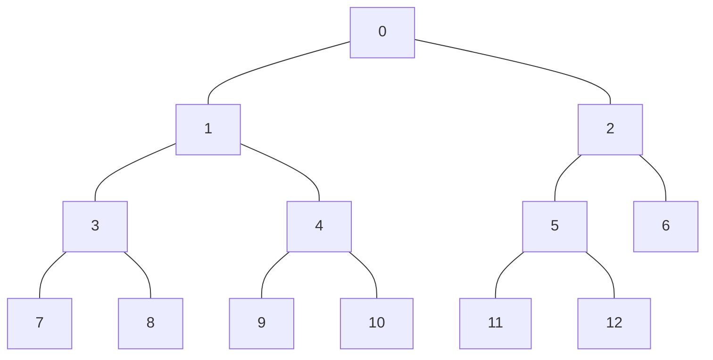

パッと見では整列されてるように見えないが、さっきのヒープを配列にするとこうなる。

```ruby
[2, 4, 3, 6, 5, 9, 11, 20, 10, 12, 7, 15]
```

### 要素の取り出し
ヒープから最小値を知るには先頭要素にアクセスすれば良いが、最小値を取り出した後はヒープが崩れているので再構築する必要がある。

ヒープから値を取り出す時のアルゴリズムは次のとおり。

1. 根の値を取り出す
1. 末端要素の値を根に置く
1. 新しい根とその子ノードの値を比較し、子の方が優先度が高ければ入れ替える
1. 3の際に子ノードが2つある場合は優先度の高い方の子を交換する
1. 3,4を優先度が『親 > 子』になるか、葉に達するまで繰り返す


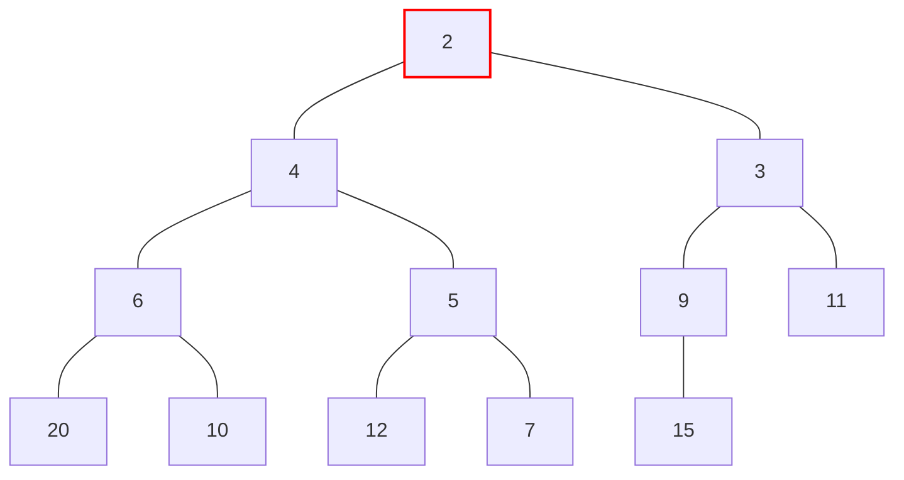

例として上記の状態から`2`を取り出す際の動きを図にしてみる。

---

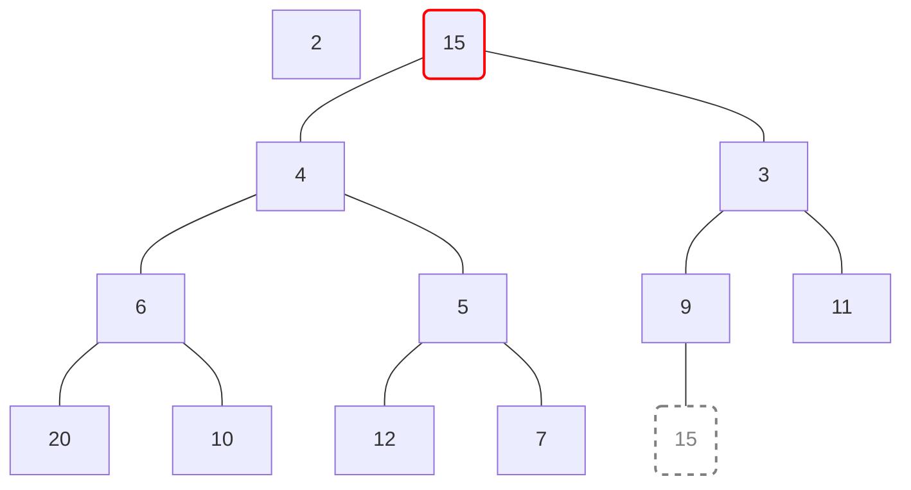

`2`を取り出した後、末端要素である`15`を根に持ってくる。

---

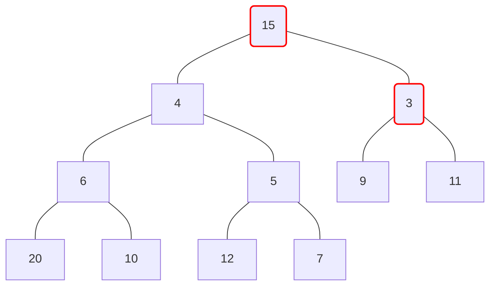

新しい根である`15`と子要素を入れ替える。子は`4`,`3`で2つあるので、優先度の高い`3`と`15`を入れ替える。

---

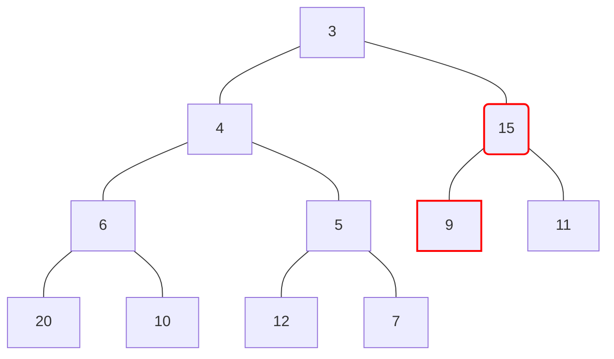

入れ替えを繰り返す。

`15`の子は`9`,`11`で2つある。優先度の高い`9`と`15`を入れ替える。

---

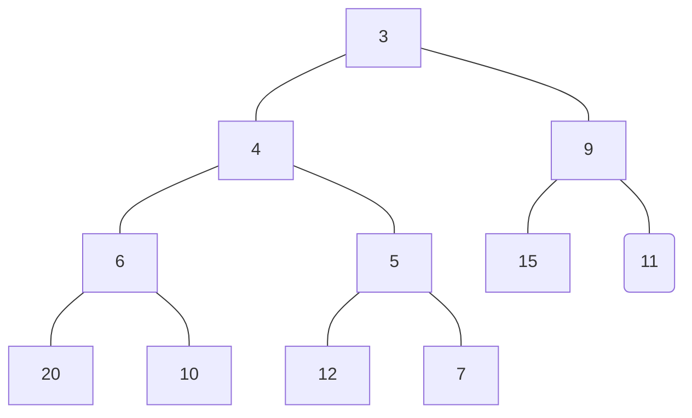

`15`に子がなくなった(=葉に達した)ので交換を終了する。

### 要素の追加
どんな優先度の要素が追加されるのかはわからないので、要素を追加した時もヒープを再構築する必要がある。

ヒープに値を追加する時のアルゴリズムは次のとおり。

1. 末端要素の右側に値を追加する
1. 追加したノード(値)とひとつ上の親の値を比べて、優先度が『親 < 子』であれば交換する
1. 2を、優先度が『子 < 親』になるまで繰り返す


例として上記の状態に`8`を追加する際の動きを図にしてみる。

---

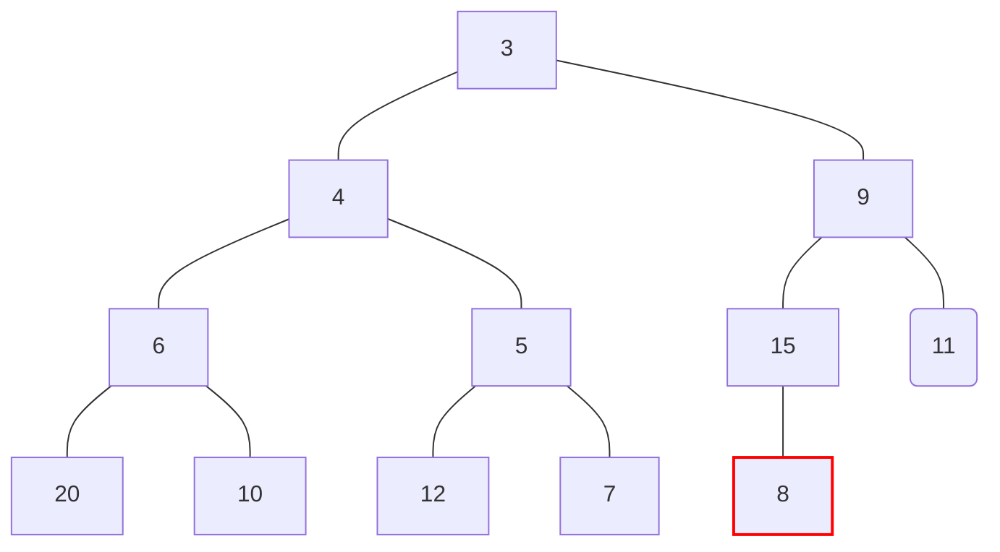

末端に`8`を追加する。

---

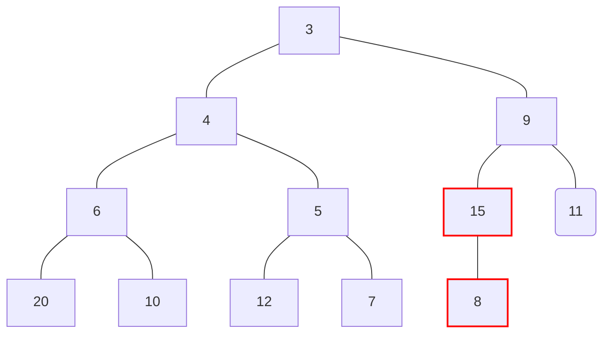

`8`の親である`15`と優先度を比較する。このヒープでは値が小さい方が優先度が高いので、優先度が『親 < 子』になっており、親子交換が発生する。

---

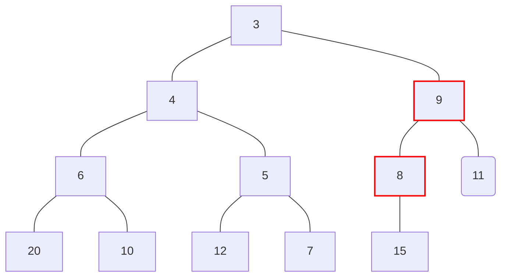

入れ替えを繰り返す。

`8`の親である`9`と優先度を比較する。優先度が『親 < 子』になっているため、親子交換が発生する。

---

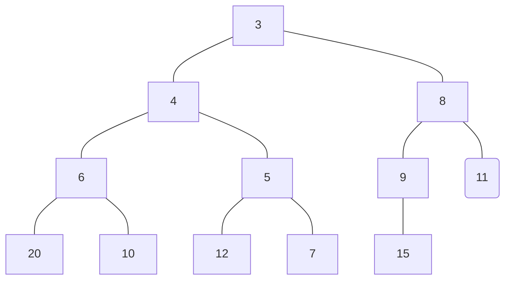

`8`の親である`3`と優先度を比較する。優先度が『子 < 親』になったので、入れ替えを終了する。

### 親や子へのアクセス
実装するにあたって、あるノード $n$ の親や子を知りたい場合がある。ヒープの性質から以下のように求められる。

- あるノード $n$ の親は $\dfrac{n-1}{2}$
- あるノード $n$ の左の子は $2n+1$
- あるノード $n$ の右の子は $2(n+1)$

## 実装した
### TLEした
で、試しに実装してみたのでABC234の[D問題](https://atcoder.jp/contests/abc234/tasks/abc234_d)に突っ込んだらTLEしまくった。

:::details 駄目だった例

```ruby
class PriorityQueue
  attr_reader :heap
 
  def initialize
    # ヒープ配列
    @heap = []
 
    # x<yなら-1, x>yなら1, x==yなら0
    # 優先順を保持する(とりあえず固定値)
    @comp = -> (x,y) { x <=> y }
  end
 
  def <<(item)
    @heap << item
 
    cur = @heap.size - 1
 
    # ヒープ再構築
    while (cur > 0)
      # 親ノードの要素番号を取得
      par = (cur - 1) / 2    
 
      if @comp[@heap[par], @heap[cur]] > 0
        swap(cur,par)
      else
        break
      end
      cur = par
    end
    self
  end
 
  def top
    return nil if @heap.size == 0
    @heap[0]
  end
 
  def deq
    item = @heap.shift
    return if @heap.size <= 1
 
    # 末尾を根に置き換える
    @heap.unshift(@heap.pop)
 
    par = 0
    loop do
      l = (2 * par) + 1 # 左の子
      r = 2 * (par + 1) # 右の子
 
      # 葉に到達したらやめる
      break if @heap[l].nil? && @heap[r].nil?
      # 優先度の高い方の子を交換候補にする
      cld = if @heap[r].nil? || @comp[@heap[l],@heap[r]] < 0
              l
            else
              r
            end
      # 親の方が優先度が高ければ交換をやめる
      break if @comp[@heap[par],@heap[cld]] < 0
 
      # 親子を交換
      swap(par,cld)
 
      par = cld
    end
    item
  end
 
  def clear
    @heap = []
  end
 
  private
  def swap(x,y)
    tmp = @heap[x]
    @heap[x] = @heap[y]
    @heap[y] = tmp
  end
end
```

:::


テストケース28のうち12が時間切れになったので、ここから少しずつコードを書き換えてリファクタリングしていった。

### ACした
ACしてる人のコード見たり、Pythonのheapq実装見たりして計算量改善したらACするようになった。要領悪いので数時間かかったものの、どう書くと遅くなるかがわかったので色々と学びが得られた。

:::details ACした優先度付きキュー

```ruby
class PriorityQueue
  attr_reader :heap

  def initialize
    # ヒープ配列
    @heap = []

    # 小さい順に優先度が高い
    @comp = -> (x,y) { x < y }
  end

  def <<(new_one)
    # 新規アイテムを末尾に入れる
    @heap << new_one
    # 末尾から上っていく
    cur = @heap.size - 1

    # ヒープ再構築
    while (cur > 0)
      # 親ノードの要素番号を取得
      par = (cur - 1) >> 1  

      # 追加アイテムより親の方が優先度が高くなったら抜ける
      # = 追加アイテムはcurの位置に収まるのが適切
      break if @comp[@heap[par],new_one]

      # 親の方が優先度が高くなるまで、子に親の値を入れていく
      # 親子入れ替えを行うと計算量が増えるため、子の値を順に上書きして最後に新規アイテムを入れる
      @heap[cur] = @heap[par]
      cur = par
    end
    @heap[cur] = new_one
    self
  end

  def top
    return nil if @heap.size == 0
    @heap[0]
  end

  def deq
    latest = @heap.pop # 末尾を取り出す
    return latest if @heap.size == 0 # 最後の1個ならそのまま返す

    # 末尾を根に置き換える
    highest = @heap[0]
    @heap[0] = latest

    size = @heap.size
    par = 0
    l = (par << 1) + 1 # 左の子

    while (l < size)
      r = l + 1 # 右の子

      # 優先度の高い方の子を交換候補にする
      cld = r >= size || @comp[@heap[l],@heap[r]] ? l : r

      # 親の方が優先度が高ければ交換をやめる
      break if @comp[latest,@heap[cld]]

      # 子の値を親に入れる
      @heap[par] = @heap[cld]

      # 親
      par = cld
      l = (par << 1) + 1 # 左の子
    end
    # 根に仮置きした値を適切な位置に置く
    @heap[par] = latest
    highest
  end

  def clear
    @heap = []
  end
end
```

:::

### 悪かったところ
#### loopが遅い
無限ループを安易に`loop`メソッドで実装していたが、`while`に変えたら1ケースACするようになった。`loop`だとブロックを繰り返し評価するので処理にオーバヘッドがかかるようだ。

#### 末尾から先頭への移動
値の取り出しをするところで、heapの末尾から根に要素を移すのに以下のように書いていたが、これが遅かった。

```ruby
# 最小値の取り出し
item = @heap.shift
# 末尾要素を根に移動
@heap.unshift(@heap.pop)
```

色々端折ったけどこうしたらACするケースが増えた。Rubyの`unshift`は大分高速らしいのだけど、単純な要素書き換えに比べれば当然遅いということらしい。それはそう。

```ruby
# 末尾の取り出し
latest = @heap.pop
# 最小値を退避(あとでreturnする)
highest = @heap[0]
# 根を上書き
@heap[0] = latest
```

#### 親子の交換
決定的に遅かったのがこれ。アルゴリズムの解説に『親と子を入れ替える』とあったので、素直に毎回親子で3ステップの入替え実装していたが、これが良くなかった。

入れ替え対象の値を退避しておいて、交換先が決まるまでは親子間で片方の値を上書きしながら進めるとステップ数が少なく済む。

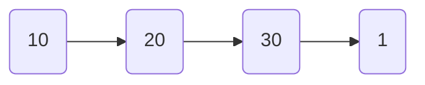
上記の配列で`1`を左右比較しながら先頭に移すケースを例示する(単純化のためにただの配列にしてある)。

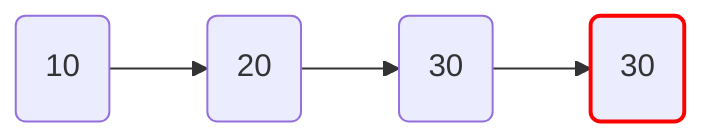

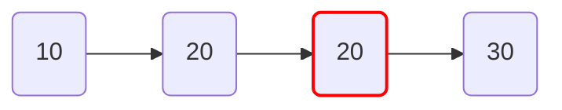

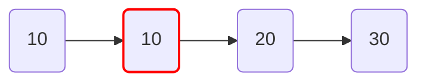

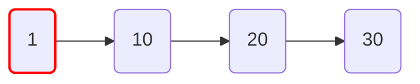

この親子交換の実装を改善したら、全ケースACするようになった。

---
競プロを始めてから計算量への意識は高まっていたけど、今回Rubyで優先度付きキューを実装したことでより意識が高まったように思う。

実務で活かせるシーンがあるかは不明だけど。
