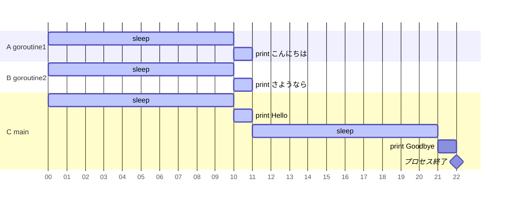
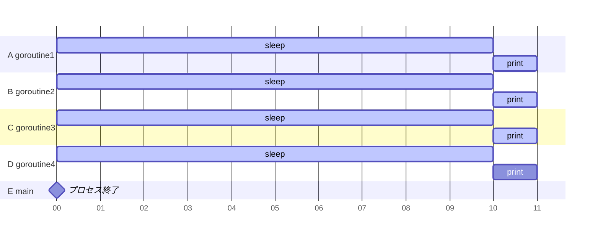

最近Golangを勉強しているが、goroutineとchannelの理解が不十分そうだったので色々試してみた。

goroutineは軽量なスレッドらしきもの、channelはgoroutine間のデータ送受信に使う。くらいの認識でいたので、まずはハローワールド的なことをして理解を深めることにする。

## goroutineで挨拶
まずはよくある例を試す。1秒待ってからメッセージ`msg`を表示する関数`f(msg)`を呼ぶコード。

```go:hello1
package main

import (
	"fmt"
	"time"
)

func main() {
	go f("こんにちは")
	go f("さようなら")

	f("Hello")
	f("Goodbye")
}

// 1秒待ってからメッセージを表示する
func f(msg string) {
	time.Sleep(1 * time.Second)
	fmt.Println(msg)
}
```

『こんにちは』『さようなら』は`go`キーワードを付けて呼び出し、『Hello』『Goodbye』はそのまま呼び出した。結果は以下の通り。

```bash:出力結果
Hello
こんにちは
さようなら
Goodbye
```

プログラム中で実行される`time.Sleep`は合計4秒だが、実時間では約2秒ですべてのメッセージが表示された。goroutine生成のオーバヘッドがかかるのでHelloが一番先に出力されたようだ。

この時の待ち時間をガントチャートにすると以下のようになる。(mermaidでミリ秒のガントチャートがうまく描けなかったので仕方なく10倍して描画した)



## main関数が先に終わるケース
先ほどの挨拶コードで、4つすべての`f(msg)`に`go`キーワードを付けたらどうなるか。

```go
package main

import (
	"fmt"
	"time"
)

func main() {
	go f("こんにちは")
	go f("さようなら")
	go f("Hello")
	go f("Goodbye")
}

// 1秒待ってからメッセージを表示する
func f(msg string) {
	time.Sleep(1 * time.Second)
	fmt.Println(msg)
}
```

```bash:出力結果

```
結果には何も出力されない。最初見た時は「なんで！？」と思ったが、よくよく考えるとmain関数は新しく生成したgoroutineに仕事を任せた後は何もしていないので、1秒寝てる間にメイン処理が終了して表示処理も行われない。特に指示しなければ、goroutineの終了は待たれないということらしい。

ちなみに、Golangのプログラムはすべてgoroutineで動くため、ここでいうメイン処理もgoroutineになる。



## goroutineの処理を待つ
他のgoroutineの処理を待つには、`sync`パッケージの`WaitGroup`を使う。

```go
package main

import (
	"fmt"
	"sync"
	"time"
)

func main() {

	var wg sync.WaitGroup
	wg.Add(4) // 4処理分待つので4を加算

	// f関数それぞれにwgを渡す
	go f("こんにちは", &wg)
	go f("さようなら", &wg)
	go f("Hello", &wg)
	go f("Goodbye", &wg)

	wg.Wait() // 4処理分終わるまで待つ
	println("Done")
}

// 1秒待ってからメッセージを表示する
func f(msg string, wg *sync.WaitGroup) {
	defer wg.Done() // 処理が終わったらDoneする(wgから1減算される)

	time.Sleep(1 * time.Second)
	fmt.Println(msg)
}
```

これで実行すると、以下のようにサブのgoroutineの表示処理が終わってからメインgoroutineの『Done』表示が行われる。『Done』以外の表示順は不定。

```bash:出力結果
さようなら
Goodbye
Hello
こんにちは
Done
```

ちなみに、他のgoroutineの処理終了だけでなく、処理結果を受け取りたい場合はchannelを使って値の受け渡しをしつつ待ち受けをするようだ。このあたりは後日また勉強する。

## おまけでdefer
上でちょっと使ってみた`defer`についても動作を見ておく。

`defer`はファイルやストリームのクローズといった終了処理に使われる事が多いらしい。呼び出し順と逆に実行されるという特徴がある。

```go
package main

import "fmt"

func main() {
	defer fmt.Print("\n")
	defer fmt.Print("!")
	defer fmt.Print("d")
	defer fmt.Print("l")
	defer fmt.Print("r")
	defer fmt.Print("o")
	defer fmt.Print("w")
	defer fmt.Print(" ")
	defer fmt.Print(",")
	defer fmt.Print("o")
	defer fmt.Print("l")
	defer fmt.Print("l")
	defer fmt.Print("e")
	defer fmt.Print("h")
}
```

```bash:出力結果
hello, world!
```

なんでLIFOで実行されるのかというと、再帰的に呼ばれる処理や入れ子構造のリソースにおいて適切な順で後処理をするためと考えるとイメージしやすそう。

---
本当はchannelまで勉強したかったけど、mermaidのガントチャート表示に思いの外時間を取られてしまったので今日はこの辺にしておく。